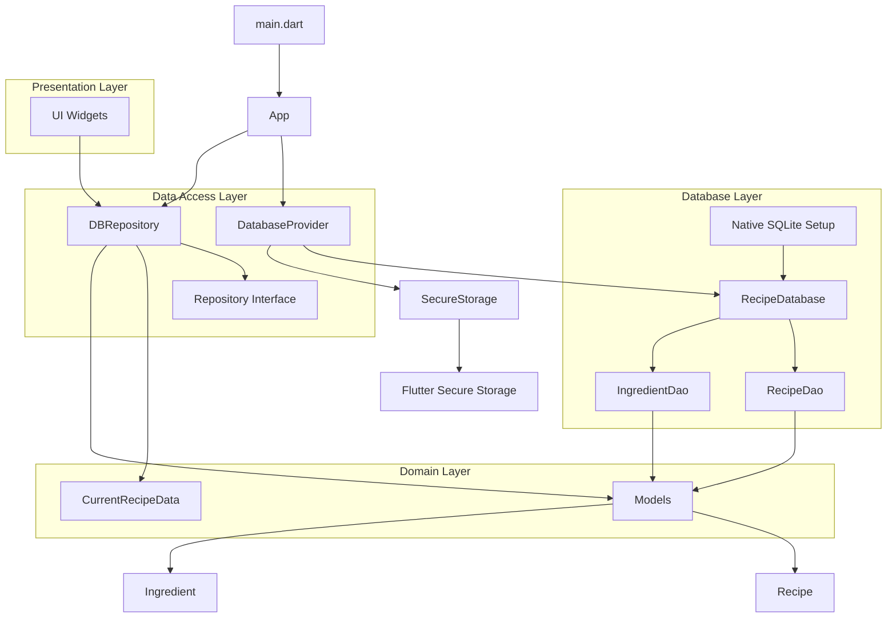

This Flutter App Structure Diagram illustrates the architecture of the recipe management app. Here's a breakdown of the main components and their relationships:

1. **Entry Point**:
    - `main.dart`: The entry point of the application.
    - `App`: The root widget of the application.

2. **Data Access Layer**:
    - `DatabaseProvider`: Manages database connections and provides access to DAOs.
    - `DBRepository`: Implements the Repository interface and acts as a mediator between the database and the application logic.
    - `Repository Interface`: Defines the contract for data operations.

3. **Database Layer**:
    - `RecipeDatabase`: The main database class generated by Drift.
    - `RecipeDao` and `IngredientDao`: Data Access Objects for recipes and ingredients.
    - `Native SQLite Setup`: Handles platform-specific SQLite initialization.

4. **Domain Layer**:
    - `Models`: Contains `Recipe` and `Ingredient` model classes.
    - `CurrentRecipeData`: Represents the current state of recipe data.

5. **Presentation Layer**:
    - `UI Widgets`: Represents various UI components that interact with the `DBRepository`.

6. **Security**:
    - `SecureStorage`: A wrapper around Flutter Secure Storage for managing encryption keys.

Key Relationships:
- The `DatabaseProvider` initializes and manages the `RecipeDatabase`.
- The `DBRepository` uses the `DatabaseProvider` to access data and implements the `Repository` interface.
- UI Widgets interact with the `DBRepository` to perform CRUD operations and observe data changes.
- The `RecipeDatabase` uses `RecipeDao` and `IngredientDao` to perform database operations.
- `Models` are used throughout the app, from the database layer to the presentation layer.

This structure follows clean architecture principles, separating concerns between data access, business logic, and presentation. It allows for easy testing, maintenance, and scalability of the application.

Would you like me to elaborate on any specific part of this structure or explain how certain components interact in more detail?